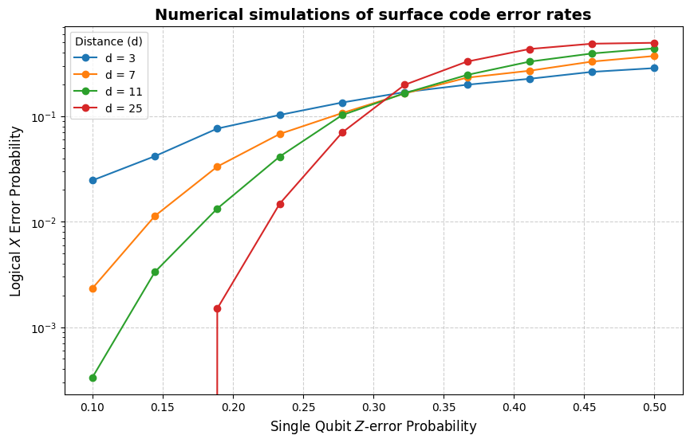

# surface-code
- Ongoing review and follow-up of my previous undergraduate group research project; "Modeling Three-dimensional Surface Codes on Cubic Lattices" in https://github.com/MoonSumin123/Surface_Code
- This project is to practice "Surface codes: Towards practical large-scale quantum computation."

## 1. Error models for surface codes

During the surface code cycles, the model includes the following errors:
1. Performing a single qubit operation $\hat{X}, \hat{Y}, \hat{Z}$ each occurring with probability $p/3.$
2. Initializing a qubit not $|g\rangle$ but $|e\rangle$ with probability $p.$
3. Attempting to perform a measure qubit Hadamard operation $\hat{H}$ but performing in addition one of the single qubit oeprations $\hat{X}, \hat{Y}, \hat{Z}$, each with probability $p/3$.
4. Reporting a wrong value of a measure qubit $\hat{Z}$ measurement and projecting to the wrong state with probability $p$.
5. Instead of CNOT, performing one of the two-qubit operations: $\hat{I}\otimes\hat{X},\hat{I}\otimes\hat{Y},\hat{I}\otimes\hat{Z},\hat{X}\otimes\hat{I},\hat{X}\otimes\hat{X},\hat{X}\otimes\hat{Y},\hat{X}\otimes\hat{Z},\hat{Y}\otimes\hat{I},\hat{Y}\otimes\hat{X},\hat{Y}\otimes\hat{Y},\hat{Y}\otimes\hat{Z},\hat{Z}\otimes\hat{I},\hat{Z}\otimes\hat{X},\hat{Z}\otimes\hat{Y},\hat{Z}\otimes\hat{Z},$ each with probability $p/15.$

### 1.1. Class-Simple

To simplify errors, this model abstracted the noises by assuming that all accumulated errors manifest on the data qubits immediately before the measurement cycle. Specifically, bit-flip ($X$) and phase-flip ($Z$) errors are probabilistically applied to the data qubits.

### 1.2. Class-0

TBA: errors per cycle considered

## References
- Fowler, A. G., Mariantoni, M., Martinis, J. M., & Cleland, A. N. (2012). Surface codes: Towards practical large-scale quantum computation. _Physical Review A,_ 86(3). https://doi.org/10.1103/physreva.86.032324
- Higgott, O. (2022). PyMatching: A Python Package for Decoding Quantum Codes with Minimum-Weight Perfect Matching. _ACM Transactions on Quantum Computing,_ 3(3), 1–16. https://doi.org/10.1145/3505637
