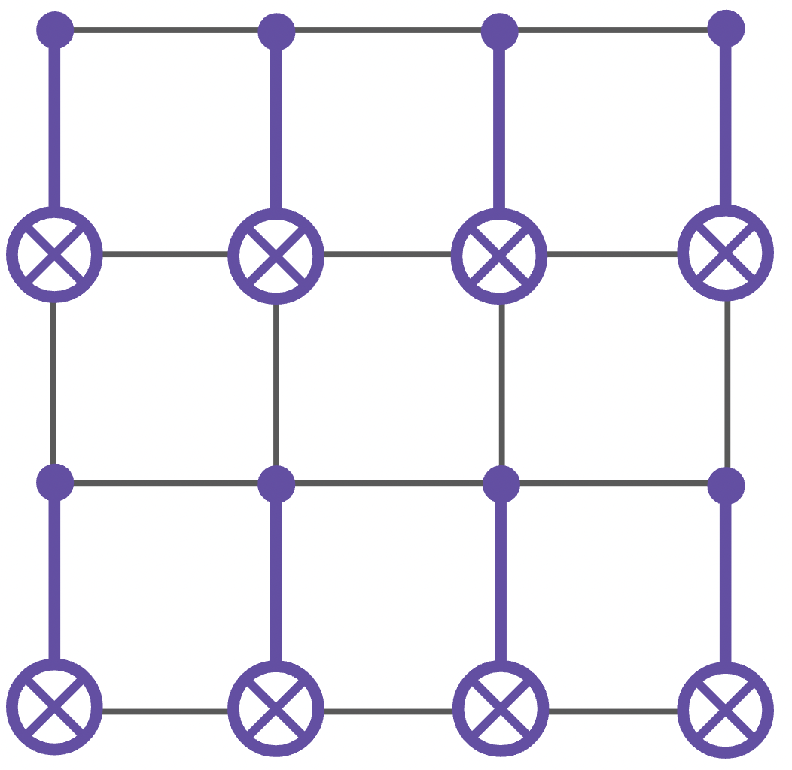
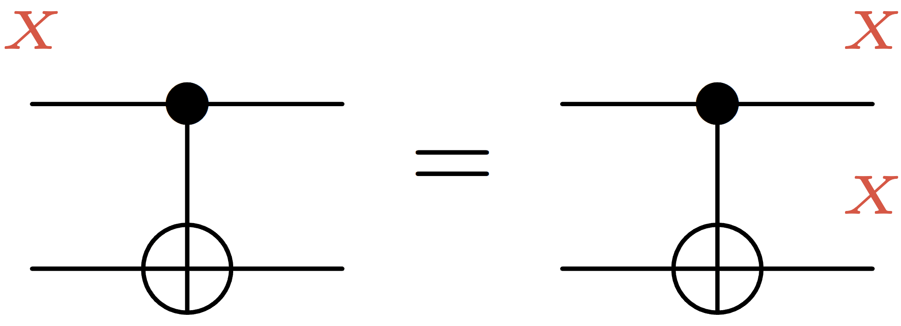
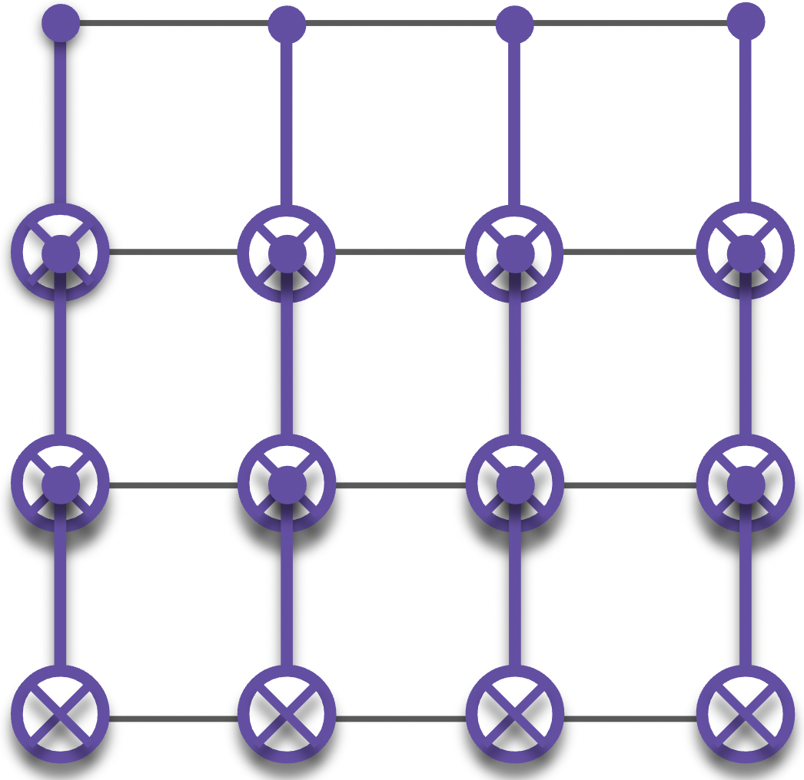
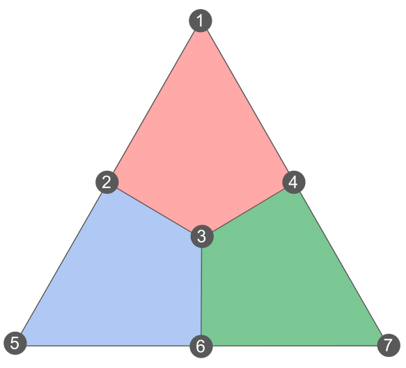
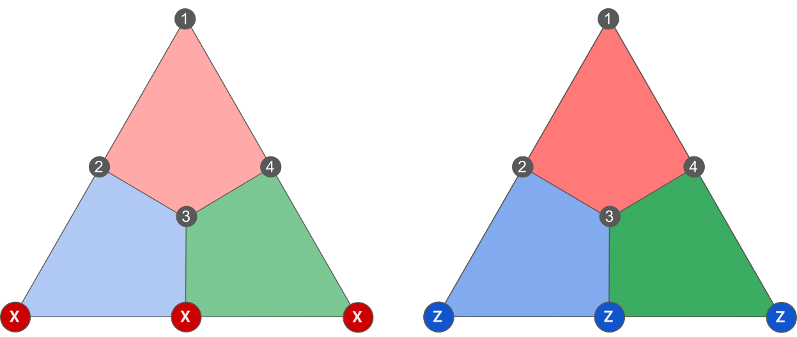
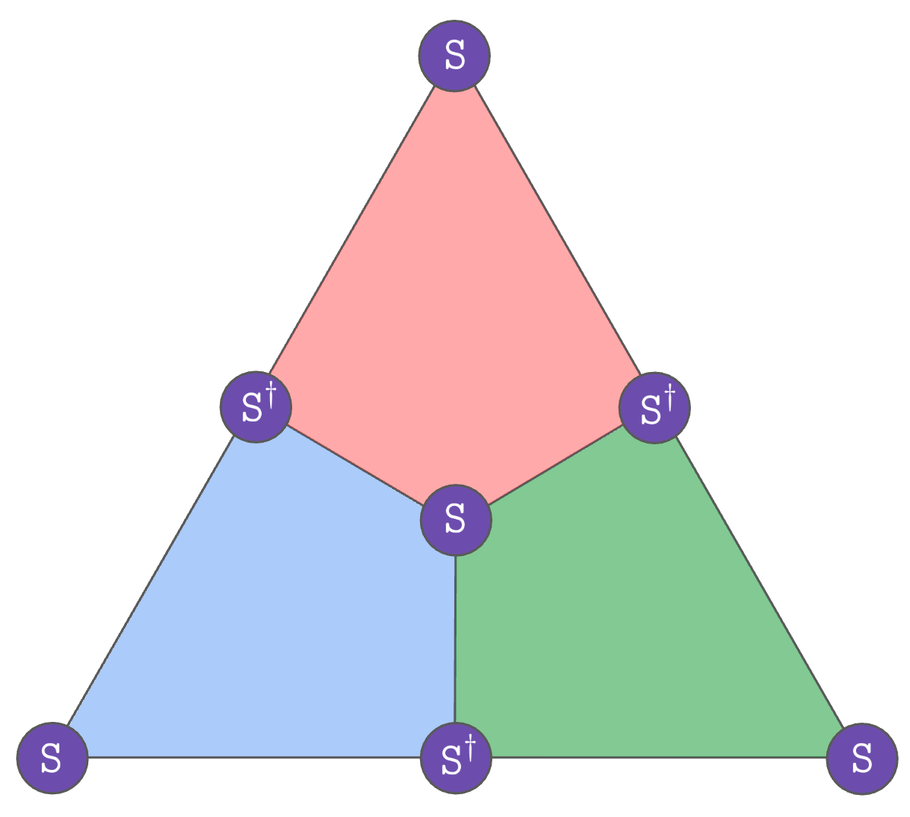
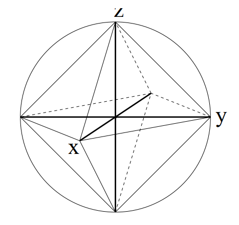
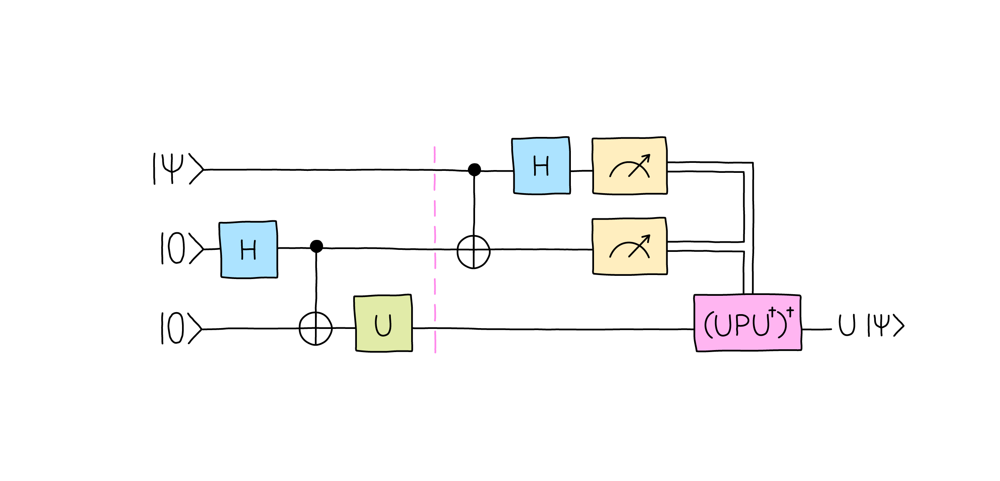

## Background

### Logical Gate

**Definition 1.** A **logical unitary gate** is a unitary operator $U$ acting on the $n$ physical qubits of the code, that preserves its codespace $\mathcal{C},$ that  is
$$
U|\psi\rangle\in\mathcal{C},\ \forall|\psi\rangle\in\mathcal{C}.
$$

**Example 1.** If we start in a state $a|000\rangle+n|111\rangle$ in the code space of the repetition code, we want our logical operation to give us another state $a'|000\rangle+b'|111\rangle$ within the same codespace.

**Definition 2.** Consider an $[[n,k,d]]$ stabilizer code defined by the stabilizer group $\mathcal{S}$ where their elements are Pauli operators. Then the definition 1 can be reformulated as
$$
SU|\psi\rangle=U|\psi\rangle,\ \forall S\in\mathcal{S},\ \forall|\psi\rangle\in\mathcal{C}.
$$
Multiplying by $U^\dagger$ on both sides,
$$
U^\dagger SU|\psi\rangle=|\psi\rangle,\ \forall S\in\mathcal{S},\ \forall|\psi\rangle\in\mathcal{C}
$$
or, using the fact that the inverse of a logical gate is also a logical gate,
$$
U SU^\dagger|\psi\rangle=|\psi\rangle,\ \forall S\in\mathcal{S},\ \forall|\psi\rangle\in\mathcal{C}
$$

**Definition 3.** Denote the group of (both Pauli and non-Pauli) stabilizers by $\tilde{\mathcal{S}.}$ A unitary operator $U$ is a **logical gate** if and only if
$$
USU^\dagger\in\tilde{\mathcal{S}},\ \forall S\in\tilde{\mathcal{S}}.
$$

**Example 2.** How the gates transform Pauli operators:
- H: $X\leftrightarrow Z$
- S: $X\to Y$ and $Z\to Z$
- T: $X\to e^{-i\pi/4}SX$ and $Z\to Z$
- CNOT: $XI\to XX, IX\to IX, ZI\to ZI, IZ\to ZZ$

### Fault-Tolerant Gate

**Example 1.** Suppose a logical gate made of s between disjoint pairs of physical qubits:

    

Now imagine that an $X$ error appears on the top-left qubit. Since $\text{CNOT}(XI)\text{CNOT}=XX,$ or equivalently $\text{CNOT}(XI)=(XX)\text{CNOT}.$

    

Therefore, a single $X$ error propagates into two $X$ errors once we have applied our logical gate.

**Definition 1.** A **effective distance** is the minimum number of physical errors that creates a logical error after applying the gate.

**Example 2.** With only $2$ errors present before applying the gate, we can get a logical error once the gate has been applied. This means the effective distance has been reduced by $2.$

**Definition 2.** For a given family of code with a growing distance, a **fault-tolerant logical gate** is a gate that doesn't reduce the effective distance to $O(1)$ when the family is growing.

**Example 3.** Instead of example 1, suppose that $\text{CNOT}$s were acting on intersecting pairs of qubits:

    

Then, a single qubit $X$ error can propagate into the number of distance $X$ errors and create a logical error, reducing its effective distance to $1.$ Generalizing its codes of size $L\times L,$ this is not fault-tolerant.

### Transversal Gate

**Definition 1.** **Transversal gates** are logical gates that don't propagate errors within each code block such that one-qubit errors remain one-qubit errors on each code block.

**Property 1.** Transversal gates should never couple multiple physical qubits of the same code block.

**Example 1: Steane Code.** The Steane code is defined on the following triangular lattice where qubits are on vertices and both $X$ and $Z$ stabilizers on faces:

    

Consider the Hadamard gate acting on every qubits. Then any plaquette stabilizer $XXXX$ will turn into $ZZZZ$ and vice versa. Since the resulting operators are stabilizers as well, our gate perserves the stabilizer group. So it's a logical gate. Even if we pick any representative logical $X$ and $Z$ operator, such as those:

    

our gate exchanges $X_L$ and $Z_L$ and is therefore a logical Hadamard. This phase is actually $1.$ Assume $H^{\otimes7}$ implements $e^{i\theta}H.$ Showing that $\lang0|\left(H^{\otimes7}|\bar{0}\rangle\right) = 1/4,$ we can deduce $e^{i\theta} = 1.$

**Example 2.** Now we apply $S$ gate to all the physical qubits to find out whether an $S$ gate can be implemented transversally. Since $SXS^\dagger=Y,$ every $X$ plaquette will turn into $Y^{\otimes4}$ under the action of our gate. Since $Y^{\otimes4}=(iXZ)^{\otimes4}=X^{\otimes4}Z^{\otimes4}$, so $Y^{\otimes4}$ is a stabilizer. Moreover, since $SZS^\dagger=Z,$ Z plaquettes are preserved. Hence, this gate is a valid transversal logical gate.

For our gate to be a logical $S$ gate, we need to prove that $S\bar{X}S^\dagger = \bar{Y}.$ Picking the logical $X$ operator supported on three qubits from example 1, we can see that the gates turns $\bar{X}$ into $Y^{\otimes 3}=(iXZ)^{\otimes 3}=-iX^{\otimes 3}Z^{\otimes 3}=-i\bar{X}\bar{Z}=-\bar{Y}.$ So $S^{\otimes 7}$ turns any logical $X$ into a $-Y$ logical. Thus, what this gate actually implements is a logical $S^\dagger.$

To implement an actual logical $S$, we instead apply $S^\dagger$ everywhere, but there exists many more solutions: (color code)

    

However, any operator made of $T$ and $T^\dagger$ on every physical qubit of the Stean code does not implement a logical gate.

**Example 3.** $\text{CNOT}$ gate is transversal for any CSS code. However, despite its simplicity, it is too impractical when dealing with a planar architecture. It requires either putting one code block above the other or having long-range connections. Alternatively, methods based on lattice surgery or code deformation are used.

## Introduction

### 2D Topological Codes

- The primary candidates for implementing QEC have been 2D topological codes, such as the surface code, color code, and their variants.
- These codes are favored for their **local stabilizer** structures and high **error thresholds**, and have been successfully demonstrated on various quantum computing platforms.
    - The locality ensures that the syndrome readout requires only short-range quantum gates and that each qubit participates only in a few gates.
    - If the physical error rate is less than the threshold value, errors can be detected and eliminated. However, if the error rate is above the threshold, then errors begin to accumulate. The actual value of error threshold depends on the error correction scheme and the error model.

#### Limitations

- The **Clifford group** is the group of unitary operators that map the group of Pauli operators to itself under conjugation. There is a structure connecting infinite classes of gates called the **Clifford hierarchy**.
    - **Pauli group ($\mathcal{C}_1$)** is at the bottom of this hierarchy. It contains the Pauli gates and their tensor products for $n$ qubits.
    - Members of the **Clifford group ($\mathcal{C}_2$)** map Pauli gates to Pauli gates under conjugation:
    $$
    \mathcal{C}_2=\{U:UPU^\dagger\in\mathcal{C}_1,\ \forall P\in\mathcal{C}_2\}.
    $$
    As an example, this group conjugate Paulis such that $HZH^\dagger=X$ and $SYS^\dagger=-X.$ Note that $\mathcal{C}_1\subset\mathcal{C}_2$.
    - Members of **$\mathcal{C}_3$** map $\mathcal{C}_1$ gates to $\mathcal{C}_2$ gates under conjugation:
    $$
    \mathcal{C}_3=\{U:UPU^\dagger\in\mathcal{C}_2,\ \forall P\in\mathcal{C}_1\}.
    $$
    For example, $T$ gate conjugates Pauli gates such that $TXT^\dagger=e^{-i\pi/4}SX~SX$ up to a global phase. $XS$ is in fact Clifford and $SX$ as well.
    - More generally, the $k^{\text{th}}$ level of the Clifford hierarchy for $k\geq 2$ is:
    $$
    \mathcal{C}_k=\{U:UPU^\dagger\in\mathcal{C}_{k-1},\ \forall P\in\mathcal{C}_1\}
    $$
    There are infinitely many non-empty $\mathcal{C}_k$ sets, and $\mathcal{C}_1\subset\mathcal{C}_2\subset\cdots\mathcal{C}_k\subset\mathcal{C}_{k+1}\subset\cdots$.
- **Gottesman-Knill theorem** states that by operations of such as 
    - Preparation of a qubit in the state $|0\rangle,$
    - Application of unitary operators from the Clifford group,
    - Measurment of an eigenvalue of a Pauli operator on any qubit, 

    one can only obtain 6 points on the Bloch sphere called **stabilizer states**:
    

        
    

    
    Such a state can be specified as an intersection of eigenspaces of pairwise commuting Pauli operators, which are referred to as **stabilizers**.
    - We can easily simulate the evolution of the stabilzer state and the statistics of measurements on a classical probabilistic computer.
- **Eastin-Knill theorem** dictates that there can be no quantum error correction code that can implement both Clifford and non-Clifford gates transversally. Hence, the QEC codes that implement Clifford gates fault-tolerantly cannot implement non-Clifford gates fault-tolerantly.
- **Bravyi-Koenig theorem** constrains that for the 2D geometry, constant-depth circuits can only implement the Clifford group ($\mathcal{C}_2$).

#### Magic State
With the Clifford hierarchy, we can fault-tolerantly implement a gate with only gates via gate teleportation. Gate teleportation builds on top of state teleportation between Alice and Bob.

    

Suppose we apply a gate $U\in\mathcal{C}_3$ on Bob's half of the Bell state pair on the bottom, and proceed with $|\psi\rangle$ teleporation as usual. Just say Bob has a **magic state**. Upon measuring the top two qubits, a Pauli error $P$ occurs on the bottom of qubit. After measurement, the bottom qubit becomes $UP|\psi\rangle.$ Then we apply the identity $I=U^\dagger U$ to obtain
$$
UPI|\psi\rangle=UPU^\dagger U|\psi\rangle=CU|\psi\rangle.
$$
$C$ is now exposed while $U$ is applied to the state $|\psi\rangle$ first. By the Clifford hierarchy, $C$ must be a Clifford gate. Thus, $C^\dagger = UPU^\dagger = C$ can be applied to produce $U|\psi\rangle,$ the desired non-Clifford gate. 

The challenge of implementing the $\mathcal{C}_3$ gate, $U,$ has been shifted to preparing the magic state offline. We can purify the noisy states to be arbitrarily close to ideal magic states. This is the procedure performed by the **magic state distillation** algorithm.